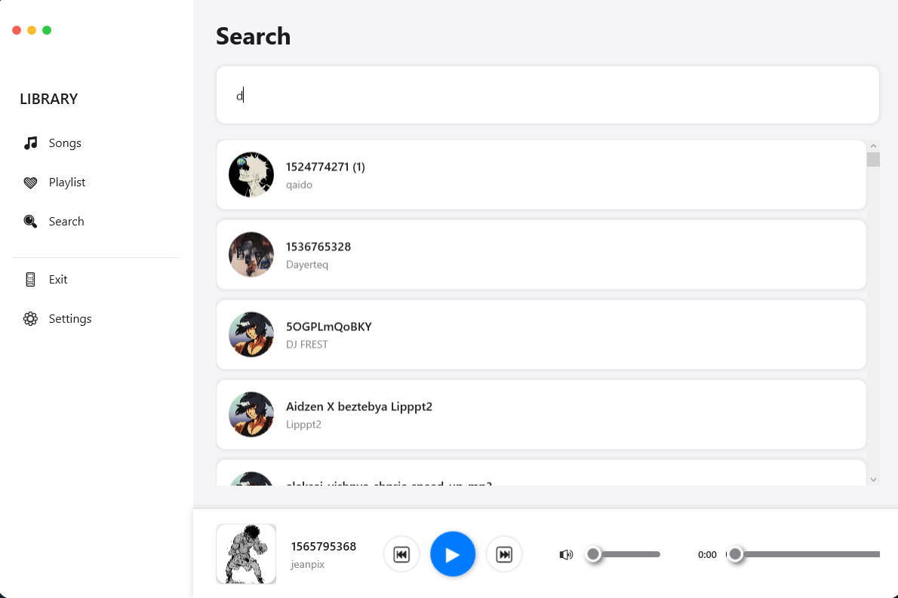

# MP3 Player

WPF музыкальный плеер с дизайном в стиле macOS. Рекурсивный поиск MP3, извлечение метаданных, реактивное обновление UI.

## Технологии

- **.NET 8.0** / **WPF** — UI фреймворк
- **TagLibSharp 2.3.0** — чтение ID3 тегов и обложек
- **NAudio 2.2.1** — воспроизведение аудио
- **ObservableCollection<T>** — реактивные коллекции для UI
- **VisualTreeHelper** — навигация по визуальному дереву
- **Dispatcher** — thread-safe обновление UI
- **Newtonsoft.Json** — сериализация избранных треков

## Архитектура

- `MusicLibrary` — статический класс для управления коллекцией треков
- `MainWindow` — главное окно с навигацией и управлением воспроизведением
- Страницы: `AllTracks`, `SearchTracks`, `Playlist`, `LikedPlaylistPage`
- Глобальное состояние через `StateMusic` и `GlobalVariables`

## Ключевые решения

### 1. Загрузка метаданных с обработкой ошибок

```csharp
var files = Directory.GetFiles(directoryPath, "*.mp3", SearchOption.AllDirectories);

foreach (var file in files)
{
    var tagfile = TagLib.File.Create(file);
    var title = Path.GetFileNameWithoutExtension(file);
    var artist = tagfile.Tag.FirstPerformer ?? "Unknown Artist";
    
    BitmapImage Art = null;
    if (tagfile.Tag.Pictures?.Length > 0)
    {
        var picture = tagfile.Tag.Pictures.FirstOrDefault(p => p.Type == TagLib.PictureType.FrontCover);
        if (picture != null)
        {
            using (var stream = new MemoryStream(picture.Data.Data))
            {
                Art = new BitmapImage();
                Art.BeginInit();
                Art.StreamSource = stream;
                Art.CacheOption = BitmapCacheOption.OnLoad;
                Art.EndInit();
                Art.Freeze();
            }
        }
    }
    if (Art == null && DefImage != null) Art = DefImage;
    
    var musicTrack = new Music(title, artist, file, time, album, Art);
    Tracks.Add(musicTrack);
}
```

Рекурсивный поиск через `SearchOption.AllDirectories`. Извлечение обложек из ID3 тегов в `MemoryStream` с `Freeze()` для thread-safety. Fallback на дефолтную обложку при отсутствии.

### 2. Навигация по визуальному дереву для переключения треков

```csharp
private Button GetNextButton(Button currentButton)
{
    var itemsControl = FindAncestor<ItemsControl>(currentButton);
    
    if (itemsControl != null)
    {
        int index = itemsControl.Items.IndexOf(currentButton.DataContext);
        
        if (index >= 0 && index + 1 < itemsControl.Items.Count)
        {
            var nextItem = itemsControl.Items[index + 1];
            var nextContainer = itemsControl.ItemContainerGenerator.ContainerFromItem(nextItem) as FrameworkElement;
            
            if (nextContainer != null)
            {
                return FindVisualChild<Button>(nextContainer);
            }
        }
    }
    return null;
}

private T FindAncestor<T>(DependencyObject current) where T : DependencyObject
{
    while (current != null)
    {
        if (current is T ancestor) return ancestor;
        current = VisualTreeHelper.GetParent(current);
    }
    return null;
}
```

Использование `ItemContainerGenerator` для получения контейнера элемента по индексу. Обход визуального дерева через `VisualTreeHelper` для поиска родительского `ItemsControl` и дочерней `Button`. Позволяет программно переключать треки без прямых ссылок на UI элементы.

### 3. Реактивное обновление UI с thread-safety

```csharp
public AllTracks()
{
    InitializeComponent();
    Songs.ItemsSource = MusicLibrary.Tracks;
    
    MusicLibrary.Tracks.CollectionChanged += Tracks_CollectionChanged;
}

private void Tracks_CollectionChanged(object sender, NotifyCollectionChangedEventArgs e)
{
    if (Dispatcher.CheckAccess())
    {
        Songs.ItemsSource = null;
        Songs.ItemsSource = MusicLibrary.Tracks;
    }
    else
    {
        Dispatcher.Invoke(() =>
        {
            Songs.ItemsSource = null;
            Songs.ItemsSource = MusicLibrary.Tracks;
        });
    }
}
```

Подписка на `CollectionChanged` для автоматического обновления UI при изменении коллекции. Проверка `Dispatcher.CheckAccess()` перед обновлением UI из фонового потока. Сброс и переустановка `ItemsSource` для принудительного обновления `ItemsControl`.

## Скриншоты





## Установка

```bash
git clone https://github.com/D4cLoves/MusicPlayer.git
cd MusicPlayer
```

Откройте `MP3 Player.sln` в Visual Studio 2022, восстановите NuGet пакеты, запустите.

## Требования

- .NET 8.0 SDK
- Windows 10/11
- Visual Studio 2022 (рекомендуется)
